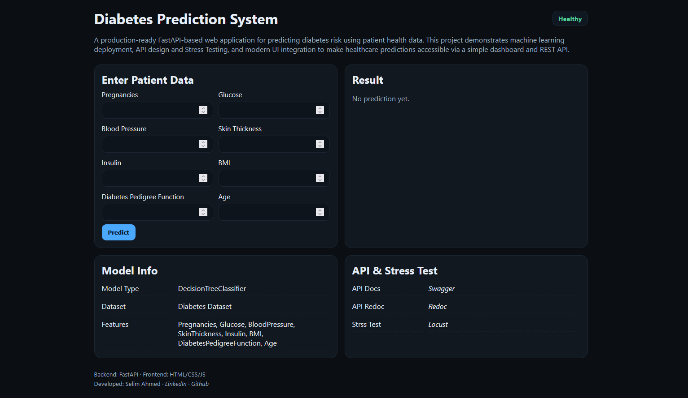
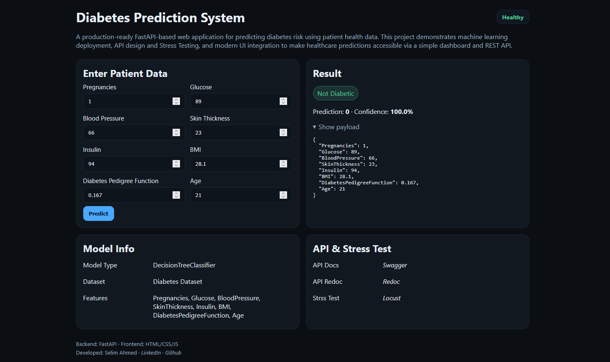

# Diabetes Prediction System
A production-ready **FastAPI** based web application for predicting diabetes risk using patient health data. This project demonstrates machine learning deployment, API design and Stress testing, and modern UI integration to make healthcare predictions accessible via a simple dashboard and REST API.

The model is trained using a DecisionTree, LogisticRegression, RandomForest, SVM and KNN on the [Pima Indians Diabetes Dataset](https://www.kaggle.com/datasets/uciml/pima-indians-diabetes-database).

<br/>

## 🚀 Quick Start

➡ **Live GUI**: [Click here](https://diabetes-prediction-eggc.onrender.com) <br/>
➡ **Swagger Docs**: [Click here](https://diabetes-prediction-eggc.onrender.com/docs)<br/>
➡ **ReDoc**: [Click here](https://diabetes-prediction-eggc.onrender.com/redoc)

<br/>

## 🌟 Features
- **Machine Learning Model**: DecisionTree trained on Pima Indians Diabetes Dataset.
- **RESTful API**: Clean, well-documented endpoints using FastAPI.
- **Stress Testing**: Define user behaviour, and swarm a system with millions of simultaneous users.
- **Type Safety**: Full Pydantic schema validation
- **Auto Documentation**: Interactive API docs with Swagger UI, ReDoc
- **Dockerized** for easy deployment.
- **Live on Render** with automatic documentation.

<br/>

## 📌 Technologies Used
- **Backend**: FastAPI, Uvicorn
- **Frontend**: HTML, CSS, JavaScript
- **ML**: Scikit-learn (Pima Indians Diabetes Dataset)
- **Testing**: Locust
- **Deployment**: Docker, Docker Compose, Render

<br/>

## 📂 Project Structure
```bash
DiabetesPrediction/
├── app
│ ├── static/
│ │ ├── index.html      # User interface
│ │ ├── styles.css      # style file
│ │ └── app.js 
│ ├── main.py           # FastAPI entry point
│ ├── schemas.py        # Pydantic request/response models
│ ├── ml_model.py 
│ └── model_train.py    # Train model with Random Forest lassifier
├── model/
│ ├── diabetes_model.joblib # Trained ML model
│ └── metrics.json    
├── sample_data/
│ └── diabetes.csv          # Sample data in csv format
├── requirements.txt        # Python dependencies
├── Dockerfile              # Docker image definition
├── docker-compose.yml      # Optional docker-compose setup
├── run_server.py           # Application entry point FastAPI and Locust both 
└── README.md               # Project documentation
```

<br/>

## 🛠 Installation & Local Development

### 1. Prerequisites
```bash
- Python 3.13.7
- pip (Python package manager)
```

### 2. Clone the repository
```bash
git clone https://github.com/Aronno1920/Diabetes-Prediction.git
cd DiabetesPrediction
```
### 3. Create and activate a virtual environment
```bash
# On Windows PowerShell
python -m venv venv
# Set-ExecutionPolicy -ExecutionPolicy RemoteSigned -Scope CurrentUser
venv\Scripts\activate

# On Linux/Mac
python -m venv env
source env/bin/activate
```
### 4. Install dependencies
```bash
pip install -r requirements.txt
```
### 5. Train the model (if not already trained)
```bash
# For training model and build joblib
python model_train.py
```
### 6. Run the API and Locust locally
```bash
python run_server.py

-------
API will be available at:
API ➡ http://localhost:8000
Swagger Docs ➡ http://localhost:8000/docs
ReDoc ➡ http://localhost:8000/redoc

-------
Locust will be available at:
ReDoc ➡ http://localhost:8089
```

<br/>

## 📖 API Endpoints

| Method | Endpoint | Description |
|--------|----------|-------------|
| GET | `/health` | Health check endpoint |
| GET | `/info` | Model information |
| GET | `/metrics` | Best model and algorithm AOC |
| POST | `/predict` | Predict Diabetes Prediction |

<br/>

## 🌐 Deployed API
```bash
Live Endpoint:
Base URL: https://diabetes-prediction-eggc.onrender.com
```
Request Body:
```bash
{
  "Pregnancies": 1,
  "Glucose": 85,
  "BloodPressure": 66,
  "SkinThickness": 29,
  "Insulin": 0,
  "BMI": 26.6,
  "DiabetesPedigreeFunction": 0.351,
  "Age": 31
}
```
Response:
```bash
{
  "prediction": 0,
  "result": "Not Diabetic",
  "confidence": 1
}
```

<br/>

## 🚦 Stress Testing with Locust
**1.** Visit 👉 http://localhost:8089<br/>
**2.** Enter:<br/>
          - Host → http://localhost:8000<br/>
          - Users → Number of simulated users<br/>
          - Spawn rate → Requests per second<br/>
**3.** Run the test and analyze live metrics.

<br/>

## 📸 Screenshots

*Screenshot of User Interface - Diabetes Prediction System*

*Screenshot of Not Diabatic - Prediction result of System*

<br/>

---

**Author**: [Selim Ahmed](https://github.com/aronno1920)  
**Project**: Diabetes Prediction System (FastAPI/GUI)
